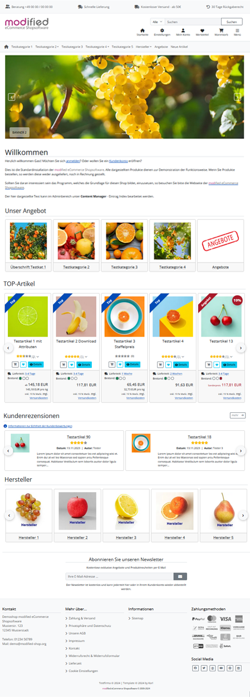

# Bootstrap5 für Modified Shop 3.x - freies responsive Template

#### Ab Version 1.1.0 steht ein zweites Template zur Auswahl
Template "bootstrap5a" hat wieder eine linke Spalte mit Menü. Unterkategorien werden per Ajax nachgeladen.

Das Template basiert auf dem Bootstrap-Framework 5 und wird getestet mit der, zum Zeitpunkt des Erscheinens eines neuen Releases, aktuellen Shopversion.

## Eigenschaften:
- responsive Template für PC, Tablet, Smartphone
- zentrales Dropdown- / Megamenü für alle Artikel
- Bilderslider auf der Startseite, im Banner-Manager befüllbar
- Startseitenartikel als Slider
- Farbbänder/Ribbons Top, Neu, Angebot
- keine Core-Änderungen nötig
- Kategorielisting (Hauptkategorien) auf Startseite (schaltbar in BS5-Konfiguration Tab "Ansichten")
- Banner Manager für Bootstrap Slider - Banner können Kategorien zugewiesen werden. 
  Jede Kategorie kann eigene Slidereinstellungen erhalten.

Vorschaubilder sind im Verzeichnis *images/* zu finden

## Systemmodul "Bootstrap 5 Template Manager"

Sobald das Systemmodul installiert ist stehen unter dem Menüpunkt **Erw. Konfiguration - Bootstrap 5 Template Manager** zahlreiche Einstellmöglichkeiten zur Verfügung.

Im Paket enthalten sind die **Module**
	- Kundenerinnerung für vorübergehend nichtverfügbare Artikel
	- Billiger gesehen?
	- Frage zum Artikel?
	- Attributauswahl als Pflichtfeld und vorbelegt mit "Bitte wählen"
	- Automatische Preisberechnung bei Attributen
	- AGI: Anzahl im Warenkorb reduzieren
	- Awids Rating Breakdown - Rezensionsaufgliederung nach vergebenen Sternen

*Diese Module sind im Template Manager zuschaltbar.*

## Installation

- Vor jeder Änderung sollte ein Backup gemacht werden!
- Die Dateien aus dem Ordner **new_files/** in den Shop kopieren (evtl. muss der Name des Admin-Ordners vorher angepasst werden).
- Im Adminbereich **Konfiguration->Mein Shop** das Template auswählen.
- Zur Nutzung des Template Managers im Adminbereich **Module->System Module** den *Bootstrap 5 Template Manager* installieren.

## Update Template Manager

Voraussetzung: Dateien sind aktuell - System Modul "Bootstrap 5 Template-Manager" installiert.

- Zur Nutzung neuer Funktionen des Template Managers muss im Adminbereich **Module->System Module** der **Bootstrap 5 Template-Manager** ausgewählt werden.
- Anschließend den Button **Update** klicken und Update ausführen.

*Hinweis: Die bisher gemachten Einstellungen werden nicht überschrieben, es werden nur neue Funktionen mit den Standardwerten hinzugefügt. 

## BS5 Theme-Einstellungen (Kurzanleitung)

Hier können bestehende Theme-Vorlagen geladen, verändert und kompiliert werden.
Installiert ist ein PHP-basierter Sass-Compiler, der Bootstrap-Sass-Variablen in eine CSS-Datei umwandelt.
Mit wenigen Änderungen ist ein komplett verändertes Aussehen zu schaffen.

- Pfad zum BS5 Template wählen
- Pfad zum BS5 Theme wählen z.B. "eigenes Theme 1" - "Aktualisieren" drücken
- Tab "eigenes Theme 1" - Vorlage wählen und Button "Vorlage laden" klicken => Vorschau wird geladen
- Änderungen machen und "Aktualisieren"
- Zurück zu Tab "Allgemeines" und "Fertig - Theme ins Template übernehmen" klicken
- Caches löschen und Shop Frontend aktualisieren

## BS5 Banner Manager
Unter dem Menüpunkt **Erw. Konfiguration - Bootstrap 5 Template Manager** ist der **BS5 Banner Manager** zu finden. 
Für den Bootstrap Slider - können den Kategorien Banner zugewiesen werden. Zudem kann jede Kategorie eigene Slidereinstellungen erhalten.

## Umbenennen des Templates

- Den Ordner "bootstrap5" einfach ändern.
- Im Adminbereich **Konfiguration->Mein Shop** das Template auswählen.

*Im Template Manager gemachte Einstellungen bleiben unverändert.*

  

### Sollten Sie mit einem Problem nicht weiter kommen, finden sich bestimmt Helfer im Modified-Forum

### [Thema: TEMPLATE: Bootstrap5 für Shop 3.x - freies responsive Template](https://www.modified-shop.org/forum/index.php?topic=43328.0)

  

Viel Spaß! 
Karl 

